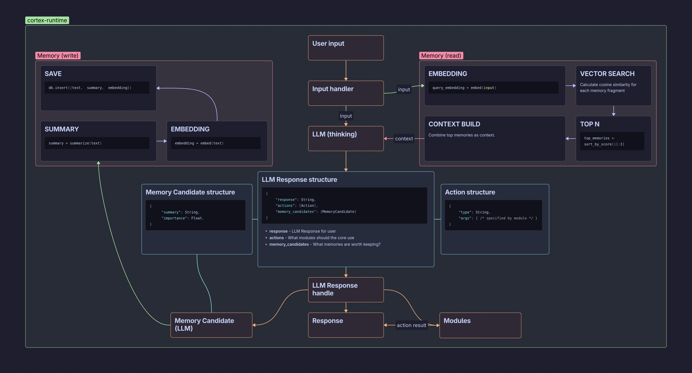

# Cortex Runtime

Cortex Runtime is a modular AI execution engine designed to build intelligent assistants that can **think, remember, and act**.

It combines:

- LLM reasoning
- semantic memory (embeddings)
- pluggable modules (actions)

---

## Features

- LLM-powered reasoning with structured outputs
- Semantic memory with embeddings
- Modular architecture (core + external plugins)
- CLI-based plugin system
- Action execution pipeline

---

## Architecture



---

## Response Format

Cortex uses structured JSON responses from the LLM:

```json
{
  "response": string,
  "actions": [
    {
      "type": string,
      "args": { /* specified by module */ }
    }
  ],
  "memory_candidates": [
    {
      "summary": string,
      "importance": float
    }
  ]
}
```

---

## Modules

Modules are responsible for executing actions.

### Types

* **Core modules** - built into the runtime
* **External modules** - standalone CLI programs

---

## External Module Protocol

Modules communicate with Cortex via CLI:

### Describe module

```bash
module --describe
```

Returns:

```json
{
  "name": string,
  "description": string,
  "keywords": [string],
  "args_schema": {}
}
```

---

### Run module

```bash
module --run { "room": "1", "state": "on" }
```

Returns:

```json
{
  "status": "ok"
}
```

---

## Memory System

Cortex uses embeddings for semantic memory:

- stores user facts and preferences
- retrieves relevant context using similarity search
- injects memory into LLM prompts

---

## Getting Started

```bash
git clone https://github.com/kirbodevv/cortex-runtime
cd cortex-runtime
cargo run
```

---

## Roadmap

- [ ] Persistent memory (database)
- [ ] Better memory ranking
- [ ] Modules execution
